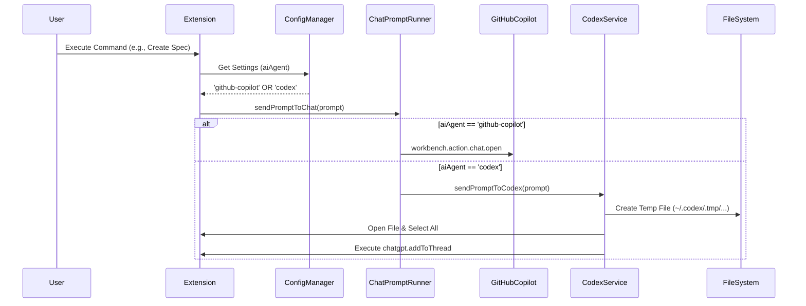

### 1. Overview
This change adds support for Codex Chat (via the ChatGPT extension) as a destination for chat instructions, in addition to the existing GitHub Copilot Chat.
Users will be able to select the AI agent to use via the `openspec-for-copilot.aiAgent` setting.
When Codex Chat is selected, the instruction content is written to a temporary file, opened in the editor, and the `chatgpt.addToThread` command is executed.

### 2. Scope & Constraints

#### In Scope
- Add `openspec-for-copilot.aiAgent` setting to `package.json`.
- Support reading the new setting in `ConfigManager`.
- Implement agent dispatch logic in `ChatPromptRunner` (or `sendPromptToChat`).
- Implement the workflow for Codex (create temporary file, open, select, execute command).
- Maintain the existing GitHub Copilot workflow.

#### Out of Scope
- Support for AI agents other than GitHub Copilot and Codex.
- Advanced cleanup functionality for temporary files (creation only).
- Support for commands other than `chatgpt.addToThread`.

#### Constraints
- Codex mode depends on the `chatgpt` extension being installed and enabled.
- In Codex mode, opening a temporary file and selecting text will shift the user's focus.

### 3. Architecture & Diagrams

`ChatPromptRunner` selects the appropriate sending strategy based on the configuration.



### 4. Implementation Details

#### 4.1. Configuration Definition (`openspec-for-copilot/package.json`)

**Purpose**: Allow users to select the AI agent.

**Changes**: Add `openspec-for-copilot.aiAgent` to the `configuration` section.

```json
"openspec-for-copilot.aiAgent": {
  "type": "string",
  "default": "github-copilot",
  "enum": [
    "github-copilot",
    "codex"
  ],
  "description": "The AI agent to use for chat interactions.",
  "order": 4
}
```

#### 4.2. Configuration Management (`openspec-for-copilot/src/utils/config-manager.ts`)

**Purpose**: Enable reading the new setting value.

**Changes**:
- Add `aiAgent` to the `OpenSpecSettings` interface.
- Add logic to read the setting value in the `getDefaultSettings` method.

```typescript
// src/utils/config-manager.ts

export interface OpenSpecSettings {
    // ... existing properties
    chatLanguage: string;
    aiAgent: "github-copilot" | "codex"; // Added
    // ...
}

// ...

private getAiAgent(): "github-copilot" | "codex" {
    const config = workspace.getConfiguration(VSC_CONFIG_NAMESPACE);
    const agent = config.get<string>("aiAgent");
    return agent === "codex" ? "codex" : "github-copilot";
}

// Call within getDefaultSettings
private getDefaultSettings(): OpenSpecSettings {
    // ...
    const aiAgent = this.getAiAgent();
    
    return {
        // ...
        aiAgent,
        // ...
    };
}
```

#### 4.3. Chat Sending Logic (`openspec-for-copilot/src/utils/chat-prompt-runner.ts`)

**Purpose**: Switch the destination based on the configuration.

**Changes**: Modify the `sendPromptToChat` function.

```typescript
// src/utils/chat-prompt-runner.ts
import { sendPromptToCodex } from "./codex-chat-utils";

export const sendPromptToChat = async (
	prompt: string,
	context?: ChatContext
): Promise<void> => {
	const configManager = ConfigManager.getInstance();
	const settings = configManager.getSettings();
    
    // Build prompt (common processing)
	const finalPrompt = buildChatPrompt(prompt, context);

    if (settings.aiAgent === "codex") {
        await sendPromptToCodex(finalPrompt);
    } else {
        // Existing GitHub Copilot processing
        await commands.executeCommand("workbench.action.chat.open", {
            query: finalPrompt,
        });
    }
};
```

#### 4.4. Codex Integration Utility (`openspec-for-copilot/src/utils/codex-chat-utils.ts`)

**Purpose**: Implement the sending process to Codex (ChatGPT).

**Changes**: Create a new file.

```typescript
// src/utils/codex-chat-utils.ts
import * as fs from "fs";
import * as path from "path";
import * as os from "os";
import { window, workspace, commands, Range, Position, Selection } from "vscode";

export const sendPromptToCodex = async (prompt: string): Promise<void> => {
    // 1. Generate temporary file path
    const homeDir = os.homedir();
    const tmpDir = path.join(homeDir, ".codex", ".tmp");
    
    // Create directory
    if (!fs.existsSync(tmpDir)) {
        fs.mkdirSync(tmpDir, { recursive: true });
    }

    const dateStr = new Date().toISOString().replace(/[-:T.]/g, "").slice(0, 14); // YYYYMMDDHHMMSS
    const randomStr = Math.random().toString(36).substring(2, 8);
    const fileName = `${dateStr}-${randomStr}.md`;
    const filePath = path.join(tmpDir, fileName);

    // 2. Write file
    fs.writeFileSync(filePath, prompt, "utf8");

    // 3. Open file
    const document = await workspace.openTextDocument(filePath);
    const editor = await window.showTextDocument(document);

    // 4. Select all
    const lastLine = document.lineAt(document.lineCount - 1);
    const range = new Range(new Position(0, 0), lastLine.range.end);
    editor.selection = new Selection(range.start, range.end);

    // 5. Execute command
    // Assuming chatgpt.addToThread sends the selected range
    await commands.executeCommand("chatgpt.addToThread");
};
```

### 5. Migration Strategy

- **No Migration Required**: Since the default value for the new `aiAgent` setting is `github-copilot`, the behavior for existing users will not change.
- The new behavior becomes active only when the user explicitly changes the setting to `codex`.

### 6. Verification Plan

#### 6.1. Unit Tests
- `ConfigManager`: Verify that the `aiAgent` setting is read correctly. Verify that the default is `github-copilot`.
- `ChatPromptRunner`: Verify that `sendPromptToCodex` or `commands.executeCommand` is called depending on the setting (using mocks).

#### 6.2. Manual Verification Scenarios

**Scenario A: GitHub Copilot (Default)**
1. Confirm that the `openspec-for-copilot.aiAgent` setting is `github-copilot` (or unset).
2. Execute any command (e.g., "Create Spec").
3. Verify that the GitHub Copilot Chat panel opens and the prompt is entered.

**Scenario B: Codex**
1. Change the `openspec-for-copilot.aiAgent` setting to `codex`.
2. Execute any command.
3. Verify that a new Markdown file is created under `~/.codex/.tmp/`.
4. Verify that the file opens in the editor and the text is selected.
5. (If the ChatGPT extension is installed) Verify that the prompt is forwarded to the ChatGPT panel.

### 7. Open Questions
- None