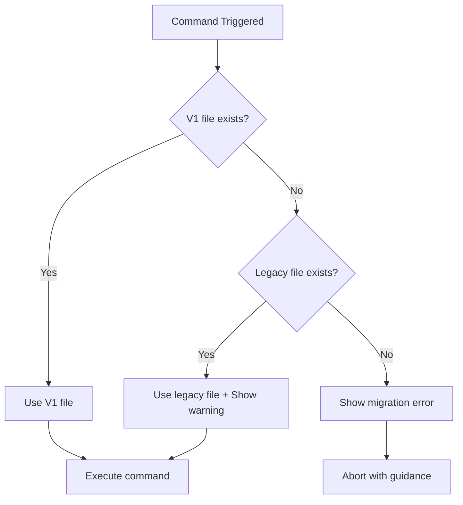

# Technical Design: OpenSpec v1 Migration Guidance

## Overview

Implement a graceful migration path from OpenSpec v0.x to v1 by adding intelligent fallback logic and detailed user guidance. The solution uses a shared utility pattern to ensure consistent behavior across all three prompt file access points.

## Architecture

### Component Structure

```
src/utils/openspec-prompt-utils.ts (NEW)
  ├─ readPromptFile()          // Main function with fallback
  ├─ createMigrationError()     // V1 not found message
  └─ createDeprecationWarning() // Legacy file warning

src/features/spec/
  ├─ create-spec-input-controller.ts (MODIFIED)
  └─ spec-manager.ts (MODIFIED)

src/activation/commands/
  └─ register-spec-commands.ts (MODIFIED)
```

### Decision Tree



## Implementation Details

### 1. Shared Utility Module

**File:** `src/utils/openspec-prompt-utils.ts`

```typescript
import { Uri, workspace, window } from "vscode";

export interface PromptFileResult {
  content: string;
  isLegacy: boolean;
  filePath: string;
}

/**
 * Reads OpenSpec prompt file with fallback to legacy version
 * @param workspaceUri - Workspace root URI
 * @param v1Filename - V1 prompt filename (e.g., "opsx-new.prompt.md")
 * @param legacyFilename - Legacy filename (e.g., "openspec-proposal.prompt.md")
 * @returns Prompt content and metadata
 * @throws Error with migration guidance if neither file found
 */
export async function readPromptFile(
  workspaceUri: Uri,
  v1Filename: string,
  legacyFilename: string
): Promise<PromptFileResult> {
  const v1Path = Uri.joinPath(workspaceUri, ".github", "prompts", v1Filename);
  const legacyPath = Uri.joinPath(workspaceUri, ".github", "prompts", legacyFilename);

  // Try V1 file first
  try {
    const fileData = await workspace.fs.readFile(v1Path);
    const content = new TextDecoder().decode(fileData);
    return {
      content,
      isLegacy: false,
      filePath: v1Path.fsPath,
    };
  } catch {
    // V1 not found, try legacy
  }

  // Try legacy file as fallback
  try {
    const fileData = await workspace.fs.readFile(legacyPath);
    const content = new TextDecoder().decode(fileData);
    
    // Show deprecation warning
    void window.showWarningMessage(
      createDeprecationWarning(legacyFilename, v1Filename),
      "Learn More"
    ).then(selection => {
      if (selection === "Learn More") {
        // Open README migration section
        const readmeUri = Uri.joinPath(workspaceUri, "README.md");
        void workspace.openTextDocument(readmeUri).then(doc => 
          window.showTextDocument(doc)
        );
      }
    });

    return {
      content,
      isLegacy: true,
      filePath: legacyPath.fsPath,
    };
  } catch {
    // Neither found, throw detailed error
    throw new Error(createMigrationError(v1Filename, workspaceUri.fsPath));
  }
}

export function createMigrationError(v1Filename: string, workspacePath: string): string {
  return `OpenSpec v1 prompt files not found.

Required: .github/prompts/${v1Filename}

To migrate to OpenSpec v1:
1. Install OpenSpec CLI v1:
   npm install -g openspec@latest

2. Initialize OpenSpec v1 in your workspace:
   cd ${workspacePath}
   openspec init

This will generate the required v1 prompt files in .github/prompts/

For more information, see README.md in your workspace.`;
}

export function createDeprecationWarning(legacyFile: string, v1File: string): string {
  return `⚠️ Using legacy OpenSpec v0.x prompt file: ${legacyFile}

Please migrate to OpenSpec v1 by running 'openspec init' in your workspace.
This will create the new prompt file: ${v1File}

Legacy support will be removed in a future release.`;
}
```

### 2. Update Create Spec Controller

**File:** `src/features/spec/create-spec-input-controller.ts`

**Changes:**
- Import `readPromptFile` utility
- Replace try-catch block with utility call
- Handle legacy warning appropriately

**Before:**
```typescript
try {
  const promptUri = Uri.joinPath(..., "opsx-new.prompt.md");
  let promptTemplate = "";
  try {
    const fileData = await workspace.fs.readFile(promptUri);
    promptTemplate = new TextDecoder().decode(fileData);
  } catch (error) {
    throw new Error("Required prompt file not found: ...");
  }
  // ... use promptTemplate
```

**After:**
```typescript
try {
  const result = await readPromptFile(
    workspaceFolder.uri,
    "opsx-new.prompt.md",
    "openspec-proposal.prompt.md"
  );
  
  if (result.isLegacy) {
    this.outputChannel.appendLine(
      `[CreateSpec] Using legacy prompt file: ${result.filePath}`
    );
  }
  
  const promptTemplate = result.content;
  // ... use promptTemplate
```

### 3. Update Spec Manager

**File:** `src/features/spec/spec-manager.ts`

Similar pattern to Create Spec Controller:
- Import utility
- Replace file reading with `readPromptFile()`
- Log legacy usage

### 4. Update Archive Command

**File:** `src/activation/commands/register-spec-commands.ts`

Similar pattern with inline command handler.

### 5. README Migration Guide

**File:** `README.md`

Add section after installation:

```markdown
## Migrating to OpenSpec v1

OpenSpec for Copilot v0.7.0+ requires OpenSpec CLI v1. If you're upgrading from an earlier version:

### Prerequisites
- Node.js 18 or higher
- npm or yarn

### Migration Steps

1. **Install OpenSpec CLI v1:**
   ```bash
   npm install -g openspec@latest
   ```

2. **Initialize OpenSpec v1 in your workspace:**
   ```bash
   cd /path/to/your/workspace
   openspec init
   ```

3. **Verify prompt files were created:**
   Check that `.github/prompts/` contains:
   - `opsx-new.prompt.md`
   - `opsx-apply.prompt.md`
   - `opsx-archive.prompt.md`
   - `opsx-continue.prompt.md`
   - `opsx-ff.prompt.md`
   - `opsx-explore.prompt.md`
   - `opsx-verify.prompt.md`
   - `opsx-sync.prompt.md`
   - `opsx-bulk-archive.prompt.md`
   - `opsx-onboard.prompt.md`

### Legacy File Support

The extension will temporarily use legacy v0.x prompt files if v1 files are not found, but will display deprecation warnings. Legacy support will be removed in a future release.

### Troubleshooting

**"OpenSpec v1 prompt files not found" error:**
- Ensure you've run `openspec init` in your workspace root
- Verify `.github/prompts/` directory exists
- Check that OpenSpec CLI is v1.0.0 or higher: `openspec --version`

**"Using legacy OpenSpec v0.x prompt file" warning:**
- Run `openspec init` to generate v1 files
- The extension will continue working with legacy files but will show warnings
```

### 6. CHANGELOG Update

**File:** `CHANGELOG.md`

Add entry:

```markdown
## [0.7.1] - 2026-01-29

### Added
- Enhanced error messages with OpenSpec v1 migration guidance
- Fallback support for legacy v0.x prompt files with deprecation warnings
- Migration guide in README.md

### Changed
- Improved user experience when migrating from OpenSpec v0.x to v1
- Consistent error handling across all prompt file operations

### Breaking Changes
- Requires OpenSpec CLI v1 for new installations
- Legacy v0.x prompt files are deprecated (still supported with warnings)
```

## Testing Strategy

### Unit Tests

**New test file:** `src/utils/openspec-prompt-utils.test.ts`

Test cases:
1. V1 file exists → returns V1 content, isLegacy=false
2. Only legacy file exists → returns legacy content, isLegacy=true, shows warning
3. Neither file exists → throws with migration message
4. Error message contains npm command
5. Warning message contains file names

### Integration Tests

Manual testing:
1. No prompt files → See migration error with clear instructions
2. Only legacy files → Commands work with deprecation warning
3. V1 files present → Normal operation, no warnings
4. Mixed (some V1, some legacy) → Each command uses appropriate file

## Migration Path

### For Users Without Any Prompt Files (New Users)
1. See clear error with installation steps
2. Run `npm install -g openspec@latest`
3. Run `openspec init`
4. Extension works

### For Users With Legacy Files (Existing Users)
1. Extension continues to work
2. See deprecation warnings
3. At their convenience:
   - Run `openspec init`
   - Warnings disappear

### For Users Already on V1
- No impact
- Normal operation

## Error Handling

All three locations follow the same pattern:
1. Try to read prompt file (with fallback)
2. On success: use content, log if legacy
3. On failure: show error with migration steps, log to output channel

## Backward Compatibility

- **Full backward compatibility** with v0.x prompt files
- Deprecation warnings educate users without breaking functionality
- Future version can remove legacy support after sufficient adoption period

## Performance Considerations

- File system access: 2 attempts max per command (V1, then legacy)
- Warning shown once per command execution
- No performance impact on successful V1 file access

## Security Considerations

- No automatic file creation
- No automatic CLI execution
- User must manually run `openspec init`
- File reading uses VSCode workspace API (sandboxed)
